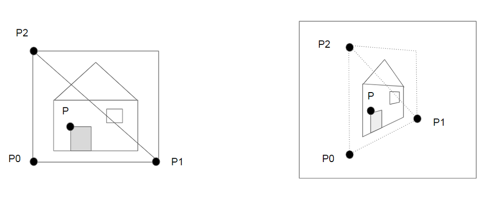

Hi fellow Oricians,

During this summer vacation I took time to explore a topic that Dbug had once suggested me to explore and that I had allways considered as impossible: Image Mapping in real-time on Oric.

I want to share here the result of my works on the topic because I am a bit suprised by what I've discovered for now.

And I would love to receive comments, remarks by peers to let me know if I'm totally wrong or if I'm right when I start thinking that something is possible in that field.

Unfortunately I don't have any running program to show. I only have an idea of a method that could possibly make it possible to do image mapping on Oric in real time.

What I call image mapping is the fact to apply an image to a shape on screen which is not neccessarly rectangular. 
[img]https://raw.githubusercontent.com/jbperin/mapimage/master/doc/img/Context.PNG[/img]

As far as I know, the only attempt that was done to do such thing was in the intro of 1337 game, where the intro text scrolls on the screen with a stunning perspective effect like in Star Wars movies: 
[url]https://youtu.be/62lJQJy-v6w?t=31[/url]

The reason why this topic seems attractive to me is because I have developped some 3D routines with glOric and, even though I have allways thought it was not possible, I've allways had the Doom stuff in mind and I've allways wondered what could be done to get as close as possible from wolfenstein on a 1 Mhz 6502 cpu.
The underlying question being : "Is there a space between 3D munch and wolfenstein ?"

In glOric, like in most 3D render engine, surfaces are made of triangles. And a rectangular image shall thus be mapped on two triangles.
In the image below I introduce this principle and I start positionning the problem on a single triangle.
[img]https://raw.githubusercontent.com/jbperin/mapimage/master/doc/img/Triangle.PNG[/img]

The problem I wanted to adress is the following one. If I want to fill the triangle P0, P1, P2 on the screen (right part of the image), I need to find for a given P point, the pixel coordinate of P in the original image (left part of the previous image)

The image below allows me to describe a little bit more accurately what I try to do:
[img]https://raw.githubusercontent.com/jbperin/mapimage/master/doc/img/Coordinates.PNG[/img]

Thus presented, the problem consists in computing pixel column and line (Pc, Pl) in the image from:
[list]
[*] its coordinate on screen (Px, Py)
[*] relatively to positions on screen of triangle'summits: P0, P1, P2
[/list]
The usual way to proceed with this kind of problem is to express the P point as a linear combination of two vectors colinear to P0P1 and P0P2. The coefficients of this linear combination are obtained by using the cross vector product.

The principle is well described here:

[url]https://mathworld.wolfram.com/TriangleInterior.html[/url]

And Dbug had provided me with some example of fast implementation on 68000 processor :

[url]http://s390174849.online.de/ray.tscc.de/fatmap.htm[/url]

[url]http://www.multi.fi/~mbc/sources/fatmap2.txt[/url]

But I dislike this approach because it implies at least 4 multiplications for each pixel P in the triangle P0,P1,P2 .
I think this approach was first done for machine such as 286 processors and eventually successfully adapted to 68000 processors.
The main trick here is that this processors can perform fixed point arithmetic on 16 or 32 bits values to avoid floating point arithmetic while keeping a good enough accuracy. 
But in my opinion it's not enough saving for our beloved 6502 processor. Because the clock frequency is far lower than on these processors and also because a 16 or 32 bits addition used in fixed point arithmetic can be performed on one instruction on processors such as 286 or 68000 but would require several addition with carry propagation to do the same on a 6502.

So I decided to find an approach based on trigonometry rather than linear algebra.
I had already done this for the projection routine in glOric and results was somewhat satisfying.
The main idea behind this approach is to avoid multiplication and find a method that rely on trigonometric operators because they can be pre-calculated in look up table.

I called:
[list]
[*] l1 the line passing by P0 and P1
[*] l1' the line passing by P and which parallel to l1
[*] l2 the line passing by P0 and P2
[*] l2' the line passing by P and which parallel to l2
[/list]
I also identify points:
[list]
[*] A which is at the intersection of l1 and l2'
[*] B which is at the intersection of l2 and l1'
[/list]
as shown in the figure below:

[img]https://raw.githubusercontent.com/jbperin/mapimage/master/doc/img/geometry2.png[/img]

The interesting thing here is that:
- the distance ratio between P0 - A  and P0 - P1 reflects the pixel's column in the image
- the distance ratio between P0 - B  and P0 - P2 reflects the pixel's line in the image

Then I did a little bit of math to see where this idea could lead:

[img]https://raw.githubusercontent.com/jbperin/mapimage/master/doc/img/solving_01.png[/img]
[img]https://raw.githubusercontent.com/jbperin/mapimage/master/doc/img/solving_02.png[/img]

I know it might look a bit fat at first sight. with lots of sine and cosine and big division and multiplication.

But if we look carefully at how the result is structured and what it is composed of, we can find some reason to hope for an efficient implementation.

Indeed, r1' and r2' are basically addition of two terms. 
One is a factor of (X0 - Xp) and the other is factor of (Y0 - Yp)
If we use an algorithm that fill the triangle P0, P1, P2 pixel by pixel from left to right and line by line, the quantity (X0 - Xp) will only vary by one between a pixel and its immediate neighbour.
and the quantity (Y0 - Yp) will only change when the filling algorithm goes from one line to the next one.

Moreover, all quantities that only rely on alpha and beta angles can be computed at the beginning of the frame render and remain unchanged during all the filling process.
It is the same for quantities bound the distance between points P0 and P1 or between points P0 and P2 because these distances remain unchanged during the filling process. 

Thus, as surprising as it could appear, filling a triangle with pixels from an image, can be done with something like 4 additions at each step .. rather than 4 multiplications.

It is such an unbelievable result that I couldn't help telling myself that I must have missed something.

Then I wrote a little python script to check if my formulae were correct.

[img]https://raw.githubusercontent.com/jbperin/mapimage/master/doc/img/Protoscript.PNG[/img]

And for now it looks like it works  :shock: 

There remain lots of work to get something really working on a real machine. 
I might have missed something that would destroy all hopes .. 

So tell me what you think of this approach ?
Do you see any mistake in the reasoning ?
Do you have any suggestion on how to implement the stuff ?